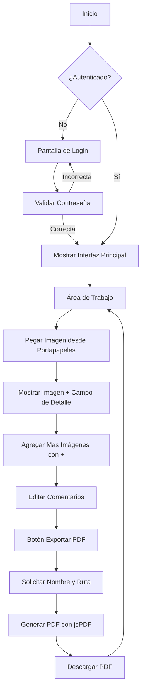

# Plan Detallado para Herramienta de Imágenes a PDF

## Arquitectura General
La aplicación será una SPA (Single Page Application) en JavaScript puro con las siguientes capas:

- **HTML**: Estructura básica con login, menú lateral y área de trabajo
- **CSS**: Estilos modernos y responsivos
- **JavaScript**: Lógica de negocio, manejo de imágenes y exportación PDF
- **Configuración**: Archivo separado con contraseña generada aleatoriamente

## Diagrama de Flujo de la Aplicación



## Estructura de Archivos
```
tools-will/
├── index.html          # Página principal
├── styles.css          # Estilos CSS
├── app.js             # Lógica principal
├── config.js          # Configuración (contraseña)
└── jsPDF/             # Librería jsPDF (CDN)
```

## Funcionalidades Clave

### 1. Seguridad
- Contraseña aleatoria de 12 caracteres generada automáticamente
- Almacenada en `config.js` (no subir a repositorios públicos)
- Validación en pantalla de login

### 2. Interfaz de Usuario
- Diseño moderno con gradientes y sombras
- Menú lateral colapsable
- Área de trabajo central para imágenes
- Botones intuitivos

### 3. Manejo de Imágenes
- Pegado directo desde portapapeles (Ctrl+V)
- Conversión automática a base64 para almacenamiento
- Vista previa de imágenes con comentarios

### 4. Exportación PDF
- Integración con jsPDF
- Cada imagen en página separada con comentario
- Diálogo para nombre de archivo y ruta de descarga

## Tecnologías
- **JavaScript ES6+**: Funciones modernas, async/await
- **CSS Grid/Flexbox**: Layout responsivo
- **jsPDF**: Generación de PDFs
- **File API**: Manejo de archivos descargados

## Consideraciones de Seguridad
⚠️ **Nota**: Esta aplicación es cliente-side, por lo que la "seguridad" es limitada. La contraseña protege solo el acceso inicial, pero el código fuente es visible. Para producción real, considerar backend.

## Próximos Pasos
Una vez aprobado este plan, procederemos a la implementación en modo Code.